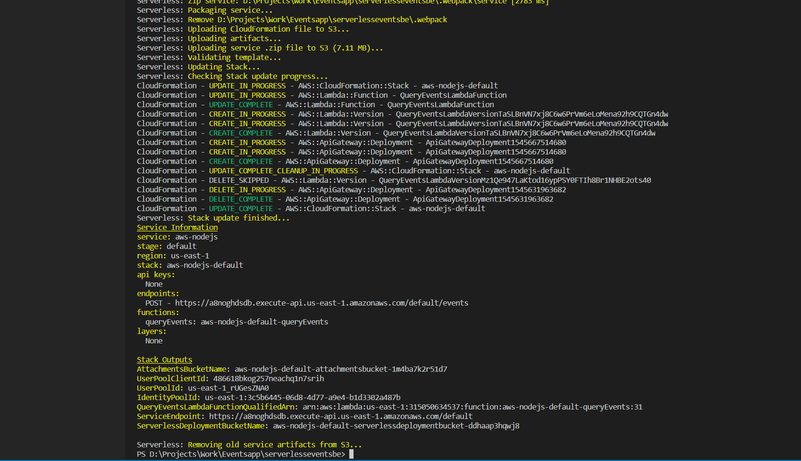
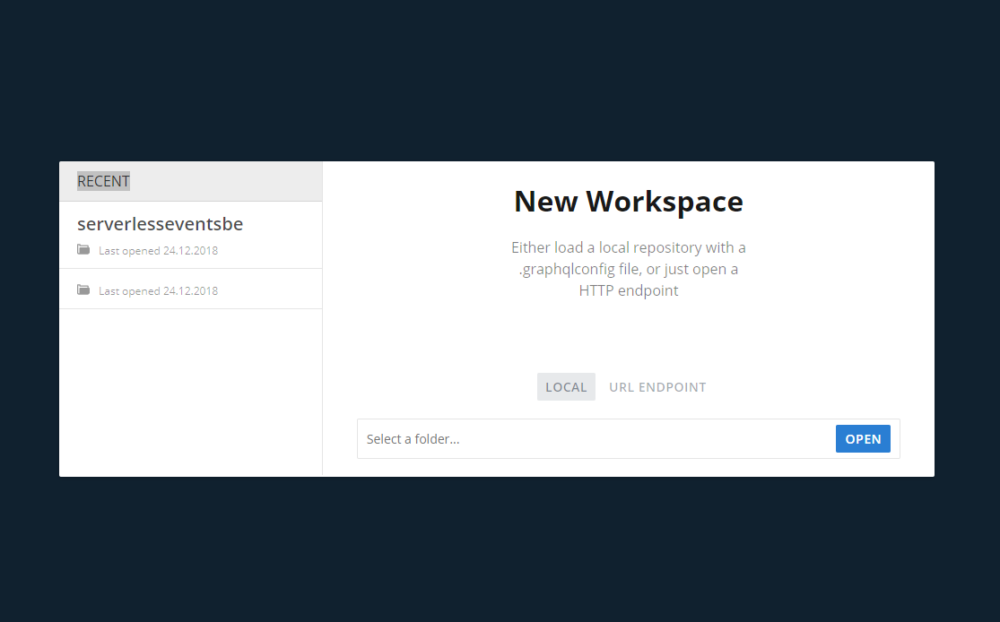
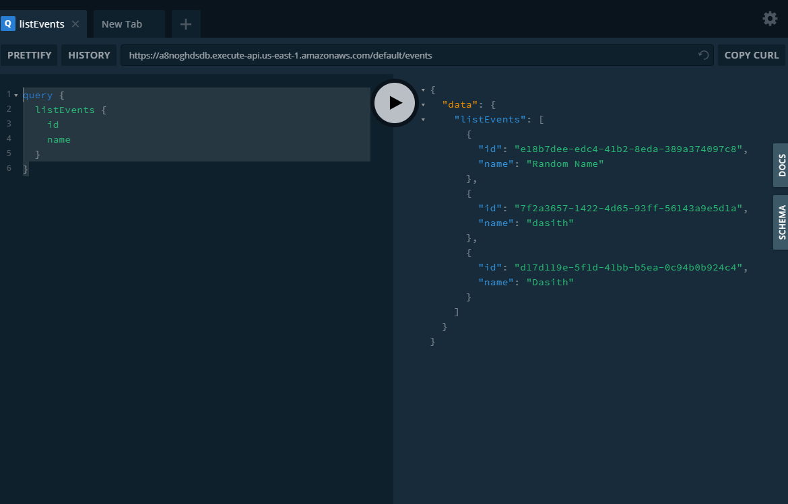

## 🌩️ Serverless Nodejs/GraphQL Boilerplate
(IaC using YML/Serverless  & other 🦄 magical stuff)

[](https://circleci.com/gh/DasithKuruppu/Serverless-GraphQL)
[](https://github.com/DasithKuruppu/Serverless-GraphQL)
[](https://github.com/DasithKuruppu/Serverless-GraphQL)
[](https://github.com/DasithKuruppu/Serverless-GraphQL)
[](https://github.com/facebook/jest)
[](https://github.com/facebook/jest)
[](http://forthebadge.com)
[](http://forthebadge.com)

Please go to [Gitlab Repo](https://gitlab.com/DasithKuruppu/serverlessgraphql) or use gitlab if you want to use free gitlab CI/CD instead of [circleCI](https://circleci.com/)

Read more on : 
* [Medium post](https://levelup.gitconnected.com/going-serverless-with-nodejs-graphql-5b34f5d280f4) on setting this up
* Vist [dasithsblog.com](https://www.dasithsblog.com/) for other cool stuff.


## Features.

---

1. ⚡ [Serverless](https://serverless.com/) YML templates(Infrastucture As Code- IAC) that provide and provision dynamic/scalable resources like DynamoDb,S3,elastic search, lambda functions etc with a single command.
2. 📜 Support for [Typescript](https://www.typescriptlang.org/).
3. 🎭 An attempt at unit testablity and test coverage via [Jest](https://jestjs.io/), this would be focused more heavily on later updates.
4. 🌀 Attempts to focus on a simple development structure / flow.
5. 🏋️‍♂️ Support for any amount of environments (Dev,Test,Production etc..) replications via Cloud formation templates.
6. 🕸️[GraphQL](https://graphql.org/) api exposed via a single endpoint with the posiblilty to scale via step functions or otherwise in future.
7. ✔️ CI/CD for all 3 environments (dev,test,production) via [Gitlab CI/CD](https://docs.gitlab.com/ee/ci/)
8. 🐋 Docker file / compose for running dynamodb offline on a docker container.


## Architecture 


## How to Install & Pre-requisites

---

**_Clone project into your local folder.... & then navigate to project on terminal or Shell_**

```javascript
npm install -g serverless

serverless config credentials --provider aws --key $AWS_ACCESS_KEY_ID --secret $AWS_SECRET_ACCESS_KEY
```

`Note that the $AWS_ACCESS_KEY_ID and $AWS_SECRET_ACCESS_KEY here needs to be replaced by credentials given to you by project owner or you may create your own AWS account and IAM role / credentials for programatic access`
[Click here for more info !!!](https://serverless.com/framework/docs/providers/aws/guide/credentials/)

Install [GraphQL Playground](https://github.com/prisma/graphql-playground/releases) `optional for easy querying`

## Getting started

---

```javascript
npm install

npm install -g graphql-cli

npm run deploy-dev

```

```javascript
npm start
```

To run it locally

## Using / Playing around with it...

---

Initially make sure you have completed steps in both **_Install & Pre-requisites_** and in **_Getting started_**

```javascript
npm run deploy-dev
```

Copy URL to the lambda function that is output onto the terminal once above command is run


Then Open GraphQL Playground and Select "URL EndPoint" and paste the Copied URL there


Then Run

```javascript
query {
  listEvents {
    id
    name
  }
}

```

To see if the GraphQL query works as inteded either by returning empty list or list of "events"


Read more on graphQL to learn Queries / Mutations to try out more queries againt the API
